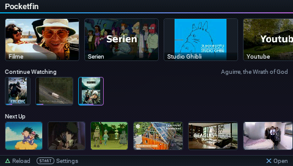

# Pocketfin




A [Jellyfin](https://jellyfin.org) client for the PlayStation Portable.

Watch the movies and shows from your Jellyfin server on your PSP.

## What you need

- A PSP running custom firmware, with a Memory Stick
- A Jellyfin server on the same network
- Wi-Fi the PSP can join: its own firmware speaks only WEP and WPA/TKIP, so
  WPA2 (AES) needs [ARK-4](https://github.com/PSP-Archive/ARK-4), which now
  has it built in, and a 2.4 GHz band either way

## Install

1. Copy the `PSP` folder to the root of the Memory Stick. It holds `PSP/GAME/pocketfin`.
2. Open `jellyfin.txt` inside it and fill in your server:

   ```
   host: 192.168.0.2
   port: 8096
   user: alice
   password: hunter2
   ```

## Building

The desktop build is native and is where most of the work happens: the same
application, in a window, with a real decoder behind it. The PSP build needs
[pspdev](https://github.com/pspdev/pspdev); on Windows it lives in WSL and
`scripts/psp.sh` shells out to it.

```sh
cmake -S src/shell/desktop -B build/desktop
cmake --build build/desktop --config Debug     # pocketfin-pc and pocketfin-test

build/desktop/Debug/pocketfin-test.exe         # the checks; add a name to filter
build/desktop/Debug/pocketfin-pc.exe           # the app in a window
build/desktop/Debug/pocketfin-pc.exe --slow 8  # at the console's link speed

make BUILD_PRX=1                               # the console: build/psp/EBOOT.PBP
make BUILD_PRX=1 dist                          # build/dist/PSP, and build/dist/pocketfin-<version>.zip
```

A handful of checks decode real artwork and skip until it is staged with
`python scripts/fixtures.py`, which needs a server and `run/jellyfin.txt`. A
skip is not a pass, so the runner exits non-zero while they are unstaged.

With a PSP attached over USB and PSPLINK running, `scripts/psp.sh` drives the
console end to end — `run [group]` to build, load and run the checks, `app` to
leave it running, `stop` to unload it, `shot` for a screenshot of the panel.

## How it is put together

`src/` is split into layers. A file may include only from its own layer or one
listed before it, and `tools/layers.sh` fails the build otherwise.

| layer | what it holds |
|---|---|
| `port` | the two machines: `port/*.h` is the seam, `port/psp/` and `port/desktop/` implement it |
| `base` | no I/O and no application knowledge: logging, JSON, workers, preferences |
| `io` | sockets, HTTP, the console's USB cable |
| `jelly` | Jellyfin itself: the API, its images, its HLS segments |
| `model` | what the application knows: the catalogue, the artwork, the film |
| `view` | the toolkit; it owns no application state |
| `page` | one file per screen |
| `app` | what runs each frame, and in what order |
| `shell` | `main()` for each machine |
| `tools` | the harness: the checks, the command channel, the drivers |

## Licence

See [LICENSE](LICENSE). The interface is set in Roboto, by Christian Robertson,
under the Apache License 2.0: see [assets/LICENSE-Roboto](assets/LICENSE-Roboto).

Pocketfin is not affiliated with the Jellyfin project or with Sony.
